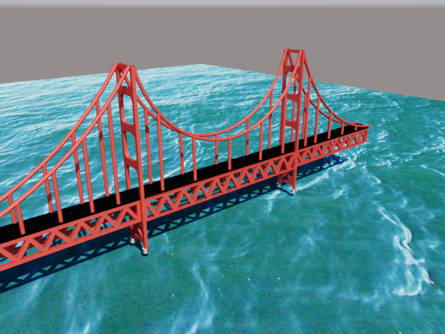
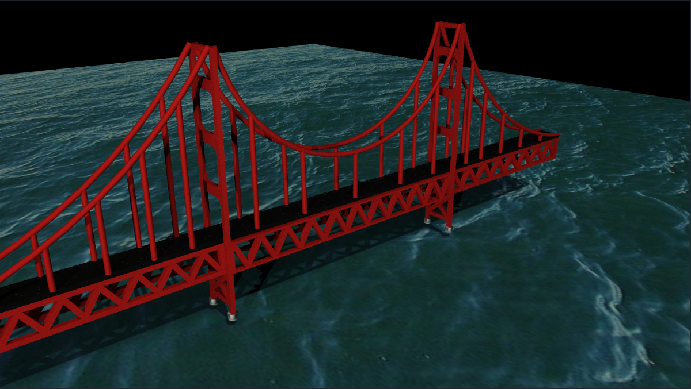

# 🌉 3D Suspension Bridge Over Water – AutoCAD Project

---

## 📖 Introduction

This project presents a **detailed 3D model of a suspension bridge**, built and rendered in **AutoCAD**. It showcases a photorealistic bridge spanning over a wave-textured water surface, ideal for presentations, simulations, or educational use in structural engineering and design.

---

## 🧵 About Suspension Bridges

A **suspension bridge** uses **cables suspended between towers** to hold up the bridge deck. The main cables are anchored at both ends and supported by tall towers, allowing for long spans and minimal structural footprint in the water. This model is inspired by iconic designs like the **Golden Gate Bridge** and demonstrates:
- Cable-based structural logic
- Load distribution across towers and deck
- Aesthetic and engineering balance

---

## 🖼️ Screenshots

### 🔦 Render 1: Cinematic Night Lighting

### 🌤️ Render 2: Bright Daylight Setup

---

## ✨ Features

- ✔️ Complete 3D modeled suspension bridge
- ✔️ Realistic water surface with bump and reflectivity
- ✔️ Two lighting setups: cinematic and daylight
- ✔️ Materials mapped and scaled properly
- ✔️ Clean geometry and shadow realism

---

## 🛠️ Built With

- 🧱 **AutoCAD** (2021–2024)
- 🎨 AutoCAD’s built-in **Material & Rendering Engine**
- 🌊 Custom water texture & bump map
- ☀️ Optional: Sunlight or photometric lighting setup

---

## ✅ How to Use

1. Open `Bridge_Model.dwg` in AutoCAD.
2. Ensure texture paths (in `Textures/`) are properly loaded.
3. Use `Realistic` visual style and `RENDER` to preview.
4. Adjust lighting or materials if needed.

---

## 🏁 Done!

Thanks for checking out this 3D bridge project!  
Feel free to fork, improve, or adapt for your own architectural or civil design needs.

---

